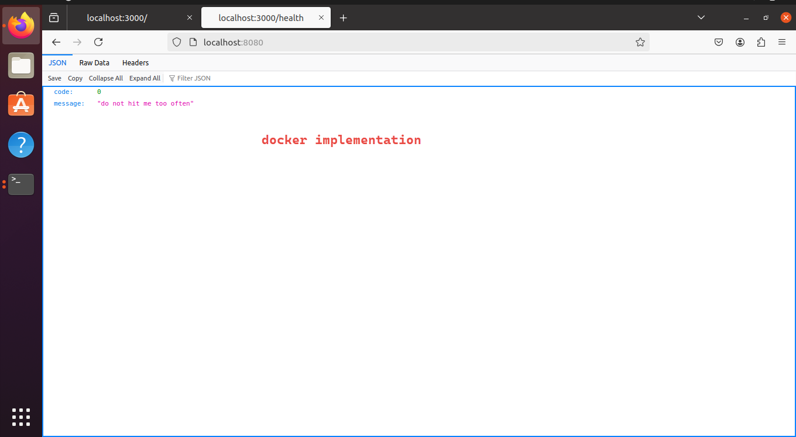
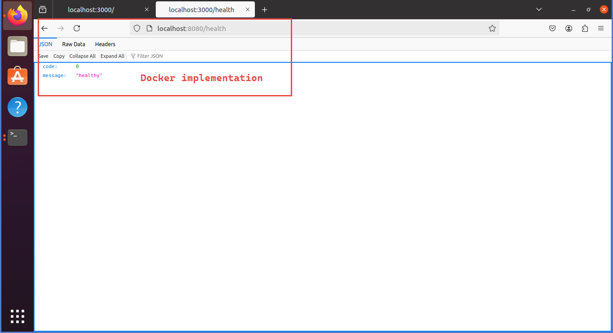
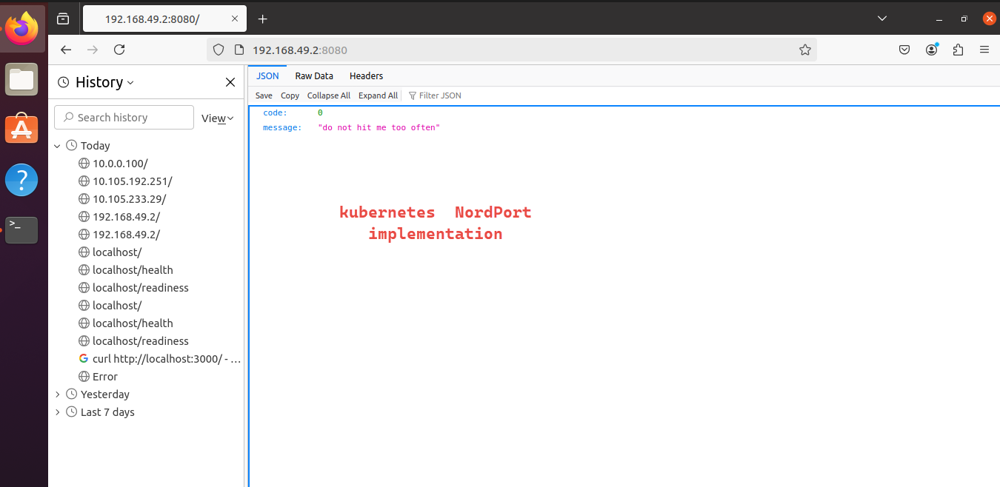
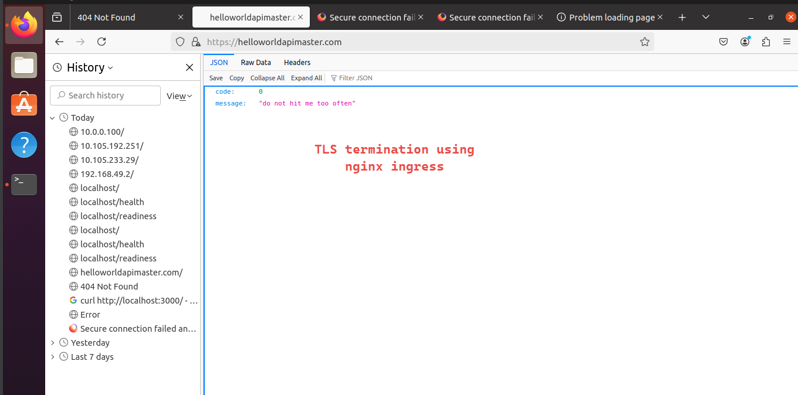

# Assignment: Testing Task 01 - DevOps (40% Marks)

Please download the attached zip folder which contains a simple web app and make it available to be deployed to Kubernetes with the following requirements:

## Requirements

1. The application should be available on port 8080 to the public audience.
2. There should be three replicas of the application running, with each replica on its own host.

## Application Details

- The application listens on port 3000.
- It has 3 APIs:
  1. **GET /** - Returns a "hello world" JSON.
  2. **GET /readiness** - Returns a 200 status code when the application is ready to start accepting incoming requests. Otherwise, it returns 500.
  3. **GET /health** - Returns a 200 status code when the application is healthy. Otherwise, it returns 500.

### Bonus Point

- Install an SSL self-signed certificate or use Let's Encrypt to secure the application.

---

### Task Summary

The following steps were undertaken to successfully deploy the application on a Kubernetes cluster:

1. **Server Configuration and Provisioning**:  
   The server was first configured by installing the necessary dependencies, including Node.js, NPM, and a container runtime (Docker). A Kubernetes cluster was then set up and provisioned for the deployment.

2. **Application Compilation and Testing**:  
   The application was pulled from the Git repository, then compiled, built, and tested using Node.js and NPM to ensure all functionalities were intact and working as expected.

3. **Containerization and Testing**:  
   A Docker image of the application was created, and the container was run to validate that the application was functioning correctly in the containerized environment.

4. **Deployment to Kubernetes**:  
   The Docker image was pushed to Minikube’s image store, and from there, the Kubernetes cluster was initialized to deploy the application.

5. **Configuring Ingress and SSL Termination**:  
   An ingress controller was configured to manage external access to the application. SSL termination was also set up, ensuring secure communication between the client and the application using either a self-signed or Let's Encrypt SSL certificate.

---

### About the Git Repository

**Repository URL**: [hello-world-api](https://github.com/jumaanr/hello-world-api-master.git)

This repository contains the **Hello World API**, a simple application designed for deployment within a Kubernetes environment. Key components include:

- **resources**: contains resources used for documentation, scripts and other no executables

- **manifests**: Kubernetes manifest files defining the required resources, such as deployments, services, and other configurations, making it easy to deploy and manage the application within a Kubernetes cluster.

- **src**: The core application code written in TypeScript, implementing the API logic and endpoints.

- **Dockerfile**: Instructions to containerize the application for consistent runtime across various environments, facilitating the build process and integration with CI/CD pipelines.

- **README.md**: Developer-focused documentation, guiding setup, configuration, and usage of the application, along with example commands and explanations for quick onboarding.

- **package.json, package-lock.json, tsconfig.json**: These files manage dependencies, TypeScript settings, and build configurations necessary for a smooth setup and build process.

---

### Server Specifications

- **Operating System**: Ubuntu 20.04 LTS
- **Environment**: Virtual Machine
- **Resources**: 4 vCPUs, 8 GB RAM

These specifications were used to test and deploy the application, providing sufficient resources for application performance and Kubernetes cluster management.

---

## Step 1: Building and Testing hello-world-api-master Application

Deploying and testing the `hello-world-api-master` application on an Ubuntu 20.04 server.

### Steps

1. **System Preparation**
   - Update package lists: `sudo apt update`
   - Install Node.js (version 18) and NPM:
     ```bash
     curl -sL https://deb.nodesource.com/setup_18.x -o /tmp/nodesource_setup.sh
     sudo bash /tmp/nodesource_setup.sh
     sudo apt install nodejs
     ```

2. **Firewall Configuration**
   - Enable firewall and allow necessary ports:
     ```bash
     sudo ufw enable
     sudo ufw allow http
     sudo ufw allow https
     sudo ufw allow 3000/tcp  # Application port
     sudo ufw allow 8080/tcp  # Public access port
     sudo ufw reload
     sudo ufw status verbose
     ```

3. **Application Setup**
   - Clone the repository
     ```bash
     cd ~
     git clone https://github.com/jumaanr/hello-world-api-master.git
     cd hello-world-api-master
     ```
   - Install project dependencies and build the application:
     ```bash
     npm install
     npm run build
     ```
   - Start the application:
     ```bash
     npm start
     ```

5. **Testing Application Endpoints**
   - Test application functionality with these commands:
     ```bash
     curl http://localhost:3000/           # Main endpoint
     curl -I http://localhost:3000/readiness  # Readiness check
     curl -I http://localhost:3000/health     # Health check
     ```

---
## Step 2: Deploy Docker and Build Docker Image and Test

Deploy and test the `hello-world-api-master` application using Docker on an Ubuntu 20.04 server.

### Steps

#### 1. **System Preparation**
   - Update package lists:
     ```bash
     sudo apt update
     ```

#### 2. **Install and Configure Docker**
   - Remove any older versions of Docker and container-related packages:
     ```bash
     for pkg in docker.io docker-doc docker-compose podman-docker containerd runc; do sudo apt-get remove $pkg; done
     ```
   - Install Docker using a convenient installation script:
     ```bash
     curl -fsSL https://get.docker.com -o get-docker.sh
     sudo sh get-docker.sh
     ```
   - Configure Docker group for easier access:
     ```bash
     sudo groupadd docker
     sudo usermod -aG docker $USER
     ```
     
#### 3. **Dockerfile Explanation**

This Dockerfile follows a multi-stage build approach to separate dependencies and optimize the production image.

```dockerfile
# First Stage: Build Stage
FROM node:18.20 AS builder

# Set the working directory
WORKDIR /app

# Copy package.json and package-lock.json to install dependencies
COPY package*.json ./

# Install all dependencies (including devDependencies)
RUN npm install

# Copy the entire application source code
COPY . .

# Compile the TypeScript code
RUN npm run build
```

1. **First Stage**:
   - Uses Node.js 18.20 as the base image for building.
   - Sets `/app` as the working directory.
   - Installs all dependencies, including development dependencies, to compile TypeScript code.
   - After copying the application source, it compiles TypeScript code to JavaScript, creating production-ready files.

```dockerfile
# Second Stage: Production Stage
FROM node:18.20

# Set the working directory
WORKDIR /app

# Copy package.json and package-lock.json to install only production dependencies
COPY package*.json ./

# Install only production dependencies
RUN npm ci --only=production

# Copy the compiled app from the builder stage
COPY --from=builder /app/dist ./dist

# Expose port 3000
EXPOSE 3000

# Set the command to run the application
CMD ["node", "dist/app.js"]
```

2. **Second Stage**:
   - Starts with a fresh Node.js 18.20 base image.
   - Installs only production dependencies for a leaner image.
   - Copies the compiled JavaScript code from the first stage.
   - Exposes port 3000 and sets the command to start the app.

#### 5. **Build and Run the Docker Image**

- Build the Docker image:
  ```bash
  docker build -t hello-world-api .
  ```
- Run the Docker container:
  ```bash
  docker run -p 8080:3000 hello-world-api
  ```
- Test the application at: `http://localhost:8080`

   

   

---

## Step 3: Install and Configure Minikube

Installing  `kubectl`, setting up Minikube, and testing the deployment environment.

### 1. Install `kubectl`

1. **Download `kubectl` Binaries**  
   Follow the official Kubernetes installation instructions for `kubectl` on Linux:
   ```bash
   curl -LO "https://dl.k8s.io/release/$(curl -L -s https://dl.k8s.io/release/stable.txt)/bin/linux/amd64/kubectl"
   ```

2. **Verify Binary with Checksum**  
   Download and verify the checksum to ensure integrity:
   ```bash
   curl -LO "https://dl.k8s.io/release/$(curl -L -s https://dl.k8s.io/release/stable.txt)/bin/linux/amd64/kubectl.sha256"
   echo "$(cat kubectl.sha256)  kubectl" | sha256sum --check
   ```

3. **Make `kubectl` Executable and Move to Path**  
   Make `kubectl` executable and move it to `/usr/local/bin/`:
   ```bash
   chmod +x ./kubectl
   sudo mv ./kubectl /usr/local/bin/kubectl
   ```

4. **Verify Installation**  
   Confirm the installation by checking the version:
   ```bash
   kubectl version --client
   kubectl version --client --output=yaml
   ```

### 2. Install Minikube

1. **Download Minikube Binary**  
   Download the latest Minikube binary and move it to the system path:
   ```bash
   curl -LO https://storage.googleapis.com/minikube/releases/latest/minikube-linux-amd64
   sudo install minikube-linux-amd64 /usr/local/bin/minikube && rm minikube-linux-amd64
   ```

2. **Start Minikube with Docker Driver**  
   Specify Docker as the driver (recommended for most development environments):
   ```bash
   minikube config set driver docker
   minikube start --extra-config=apiserver.service-node-port-range=1-65535
   minikube start --driver=docker
   ```
   Above command would increase the nordPort range for Minikube since we need to expose port 8080

### 3. Verify Minikube and Cluster Setup

1. **Check Kubernetes Namespaces and Pods**  
   Verify that Kubernetes is up and running:
   ```bash
   kubectl get namespaces
   kubectl get pods -A  # List all pods across namespaces
   ```

2. **Check Minikube Status**  
   Confirm that Minikube components are active:
   ```bash
   minikube status
   ```

---

## Step 4: Deploy Kubernetes Cluster on Minikube

### 1. Push Docker Image to Minikube

1. **Navigate to Project Directory**  
   Move to the project’s root directory:
   ```bash
   cd hello-world-api-master
   ```

2. **Configure Docker to Use Minikube’s Environment**  
   Set Docker to use Minikube’s Docker environment, allowing Minikube to access the Docker image:
   ```bash
   eval $(minikube docker-env)
   ```

3. **Build the Docker Image in Minikube’s Environment**  
   Build the Docker image so it is available directly within Minikube:
   ```bash
   docker build -t hello-world-api .
   ```

4. **Verify the Image is Available in Minikube**  
   Check that the Docker image is stored in Minikube:
   ```bash
   docker ps
   ```

### 2. Deploy Kubernetes Resources

1. **Navigate to the Manifests Directory**  
   Move to the directory containing the Kubernetes configuration files:
   ```bash
   cd ./manifests
   ```

2. **Apply Deployment and Service Manifests**  
   Deploy the application and expose it through Kubernetes services:
   ```bash
   kubectl apply -f deployment.yaml
   kubectl apply -f service.yaml
   ```

### 3. Verify the Deployment

1. **Check Deployment and Service Status**  
   Ensure that the components are deployed correctly:
   ```bash
   kubectl get deployments
   kubectl get pods
   kubectl get services
   ```

### 4. Test the Application

1. **Retrieve Minikube IP Address**  
   Use Minikube's IP as the base for accessing the service:
   ```bash
   minikube ip
   minikube tunnel
   ```

2. **Access the Application**  
   Visit the application using the following format:
   ```
   http://<minikube-ip>:3000
   ```
   Replace `<minikube-ip>` with the actual IP address retrieved in the previous step.

This process ensures the application is deployed on Minikube, accessible via a Kubernetes service, and functioning as expected.


--- 

## Step 5: Deploy Nginx Ingress Controller with SSL Termination

### Overview

1. **Reset Previous Configurations**
2. **Install Nginx Ingress Controller**
3. **Generate a Self-Signed SSL Certificate**
4. **Create a Kubernetes Secret for SSL**
5. **Create a ClusterIP Service for the Deployment**
6. **Configure the Ingress Resource**
7. **Adjust Ingress Controller to Listen on Port 8080**
8. **Access the Application**


### Step 5.1: Reset Previous Configurations

```bash
# Delete any existing services and deployments
kubectl delete service hello-world-api-service
kubectl delete deployment hello-world-api-master

# Re-apply deployment
kubectl apply -f deployment.yaml
```

### Step 5.2: Install Nginx Ingress Controller

Install the Nginx Ingress controller on Minikube cluster.

```bash
minikube addons enable ingress
```

### Step 5.3: Generate a Self-Signed SSL Certificate

Generated a self-signed SSL certificate and private key.

```bash
openssl req -x509 -nodes -days 365 -newkey rsa:2048 \
  -keyout tls.key -out tls.crt \
  -subj "/CN=helloworldapimaster.com/O=helloworldapimaster.com"
```
certificate valid for one year (`-days 365`) with the common name (`CN`) set to `example.com`.

### Step 5.4: Create a Kubernetes Secret for SSL

Created a TLS secret in Kubernetes to store the SSL certificate and key.

```bash
kubectl create secret tls hello-world-api-tls --key tls.key --cert tls.crt
kubectl get secrets
```

### Step 5.5: Create a ClusterIP Service

Created a `Service` of type `ClusterIP` to expose the deployment internally within the cluster.

**service.yaml**

Apply the service configuration:

```bash
kubectl apply -f service.yaml
```

### Step 5.6: Configure the Ingress Resource

Ingress resource to route external traffic to cluster-ip service and handle SSL termination.

**ingress.yaml**
Apply the ingress configuration:

```bash
kubectl apply -f ingress.yaml
```

### Step 5.7: Adjust Ingress Controller to Listen on Port 8080

By default, the Nginx Ingress controller listens on ports 80 and 443. Since the application has to be available on port 8080, the service type and ports have been adjusted.

#### Update the Ingress Controller Service

Edit the Nginx Ingress controller service to change the NodePort to 8080.

```bash
kubectl edit service ingress-nginx-controller -n ingress-nginx
```

modified the `spec.ports` section to set the `nodePort` for port 80 to 8080:

```yaml
spec:
  ports:
    - name: http
      port: 80
      targetPort: http
      nodePort: 8080  # Add this line
      protocol: TCP
    - name: https
      port: 443
      targetPort: https
      protocol: TCP
```

Also changed the service `type` is set to `NodePort`:

```yaml
spec:
  type: NodePort
```

### Step 5.8: Access the Application

Determine the IP address of the Minikube cluster:

```bash
minikube ip
```

#### Update the Hosts File

Since I used `helloworldapimaster.com` in the Ingress resource, I to mapped `helloworldapimaster.com` to minikube ip `/etc/hosts` file.
updated the host entry.


#### Access the Application

- **Browser Access:** Open `https://helloworldapimaster.com:8080


---
